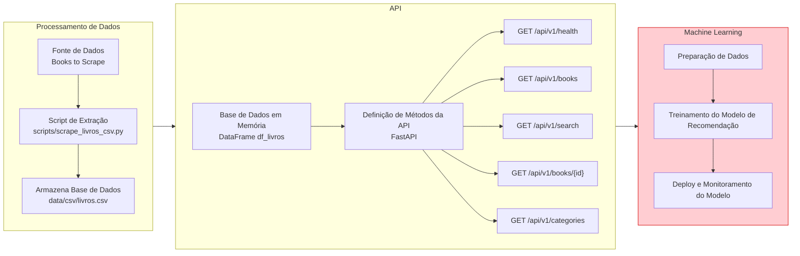

<!-- TITULO DO PROJETO -->

<h1 align="center">Fase 1: Tech Challenge Machine Learning Engineering</h1>
<br />

<!-- SOBRE O PROJETO -->
## Objetivo

Este projeto foi desenvolvido com o objetivo de construir uma infraestrutura de extração, transformação e disponibilização dos dados de livros contidos no site [Books to Scrape](https://books.toscrape.com/) e disponibilização via API pública, permitindo que **cientistas de dados e sistemas de recomendação** possam consumir dados estruturados de forma simples e eficiente.

### Tecnologias Utilizadas

* [![FastAPI][FastAPI]][FastAPI-url]
* [![pandas][Pandas]][Pandas-url]
* [![BeautifulSoup][BeautifulSoup]][BeautifulSoup-url]
* [![Requests][Requests]][Requests-url]
* [![os][OS]][OS-url]
* [![typing][Typing]][Typing-url]
* [![Vercel][Vercel]][Vercel-url]
* [![Uvicorn][Uvicorn]][Uvicorn-url]

Todos os testes foram realizados em ambiente virtual local com uso do Python 3.11.

<!-- ARQUITETURA DO PROJETO -->

## Arquitetura do Projeto

### Arquitetura Atual

O projeto foi desenvolvido com a fase de Processamento de Dados e construção de API de consulta das informações. O que está representado em caixas amarelas já está desenvolvido e o que está em vermelho seria uma evolução da arquitetura atual.



### Escalabilidade Futura

Para escalabilidade futura, arquitetura pode sofrer as seguintes evoluções:
* Substituição do CSV/Dataframe por um banco de dados relacional para armazenar os dados
* Criação de fluxo de ingestão de dados incremental para coleta de informações do site substituindo a carga completa e manual

### Cenários de Uso para Cientistas de Dados/ML
Os dados da API podem ser utilizados para:
* Criar modelos de recomendação baseados em categoria e ratings
* Analisar preços e categorias de livros

<!-- API PUBLICA -->
## API Pública (Deploy Vercel)

A API pública deste projeto está hospedada na plataforma **Vercel** e permite o consumo dos dados coletados de forma simples e escalável.  
Você pode acessá-la diretamente pelo link: [https://postech-proj-fase1-ixihc9ir3-jessycas-projects-cf4a9dab.vercel.app](https://postech-proj-fase1-ixihc9ir3-jessycas-projects-cf4a9dab.vercel.app)

### Documentação dos Endpoints da API

Para visualizar a documentação interativa (Swagger UI) e testar as requisições diretamente pelo navegador, acesse: [https://postech-proj-fase1-ixihc9ir3-jessycas-projects-cf4a9dab.vercel.app/docs](https://postech-proj-fase1-ixihc9ir3-jessycas-projects-cf4a9dab.vercel.app/docs)

A tabela abaixo descreve todos os endpoints disponíveis na API pública:

| Método | Endpoint | Descrição |
|--------|-----------|------------|
| `GET` | `/api/v1/health` | Verifica o status da API e a conectividade com os dados |
| `GET` | `/api/v1/books` | Lista ID e título de todos os livros disponíveis na base de dados |
| `GET` | `/api/v1/books/search` | Busca livros por título e/ou categoria |
| `GET` | `/api/v1/books/{id}` | Obtém informações completas de um livro específico pelo ID |
| `GET` | `/api/v1/categories` | Lista todas as categorias de livros disponíveis na base de dados |

→ Utilize o Swagger UI para explorar os endpoints, visualizar exemplos de resposta e testar filtros de busca em tempo real.

<!-- REPRODUZIR O PROJETO -->
## Reproduzir Localmente

1. Clone o Repositório
   ```sh
   git clone https://github.com/jessycalunna/postech-proj-fase1.git
   cd postech-proj-fase1
   ```
2. Crie um Ambiente Virtual
   ```sh
   python -m venv venv
   source venv/bin/activate
   ```
3. Instale as Dependências
   ```sh
   pip install -r requirements.txt
   ```
4. Execute o Script de Extração
     ```sh
   python scripts/scrape_livros_csv.py
   ```
5. Inicie a API Localmente
     ```sh
   uvicorn api.index:app --reload
   ```
   > Acesse em: [http://127.0.0.1:8000/docs](http://127.0.0.1:8000/docs)

<!-- Exemplos de Uso -->
## Exemplos de Uso da API

#### URL Base
```
https://postech-proj-fase1-ixihc9ir3-jessycas-projects-cf4a9dab.vercel.app/api/v1/
```
#### Verificar o Status da API
* CURL
```bash
curl -X GET "https://postech-proj-fase1-ixihc9ir3-jessycas-projects-cf4a9dab.vercel.app/api/v1/health"
```
* Python
```python
import requests

url = "https://postech-proj-fase1-ixihc9ir3-jessycas-projects-cf4a9dab.vercel.app/api/v1/health"
response = requests.get(url)
print(response.json())
```
#### Listar todos os livros (ID e título)
* CURL
```bash
curl -X GET "https://postech-proj-fase1-ixihc9ir3-jessycas-projects-cf4a9dab.vercel.app/api/v1/books"
```

* Python
```python
import requests

url = "https://postech-proj-fase1-ixihc9ir3-jessycas-projects-cf4a9dab.vercel.app/api/v1/books"
response = requests.get(url)
for book in response.json()[:5]:
    print(book)
```
#### Buscar livros por título e/ou categoria
* CURL
```bash
curl -X GET "https://postech-proj-fase1-ixihc9ir3-jessycas-projects-cf4a9dab.vercel.app/api/v1/books/search?title=travel&category=nonfiction"
```

* Python
```python
import requests

params = {"title": "travel", "category": "nonfiction"}
url = "https://postech-proj-fase1-ixihc9ir3-jessycas-projects-cf4a9dab.vercel.app/api/v1/books/search"
response = requests.get(url, params=params)
print(response.json())
```
#### Obter detalhes do livro por ID
* CURL
```bash
curl -X GET "https://postech-proj-fase1-ixihc9ir3-jessycas-projects-cf4a9dab.vercel.app/api/v1/books/42"
```

* Python
```python
import requests

book_id = 42
url = f"https://postech-proj-fase1-ixihc9ir3-jessycas-projects-cf4a9dab.vercel.app/api/v1/books/{book_id}"
response = requests.get(url)
print(response.json())
```

#### Listar todas as Categorias de Livros
* CURL
```bash
curl -X GET "https://postech-proj-fase1-ixihc9ir3-jessycas-projects-cf4a9dab.vercel.app/api/v1/categories"
```

* Pyhton
```python
import requests

url = "https://postech-proj-fase1-ixihc9ir3-jessycas-projects-cf4a9dab.vercel.app/api/v1/categories"
response = requests.get(url)
print(response.json())
```

💡 Todos os endpoints retornam respostas em formato **JSON**, prontas para uso em **pipelines de dados**, **dashboards** ou **modelos de Machine Learning**.

<!-- AUTORA -->
## Autora

Jessyca Oliveira - jessyca.lunna@gmail.com

Vídeo Apresentação: [](https://drive.google.com/file/d/1El5cL5RxRPcxBD2EQAwOXRAa9PiGcvk2/view?usp=sharing)

<!-- LINKS E IMAGENS -->
[FastAPI]: https://img.shields.io/badge/FastAPI-009688?style=for-the-badge&logo=fastapi&logoColor=white
[FastAPI-url]: https://fastapi.tiangolo.com/
[Pandas]: https://img.shields.io/badge/pandas-150458?style=for-the-badge&logo=pandas&logoColor=white
[Pandas-url]: https://pandas.pydata.org/
[BeautifulSoup]: https://img.shields.io/badge/BeautifulSoup-4B8BBE?style=for-the-badge&logo=python&logoColor=white
[BeautifulSoup-url]: https://beautiful-soup-4.readthedocs.io/
[Requests]: https://img.shields.io/badge/Requests-007ec6?style=for-the-badge&logo=python&logoColor=white
[Requests-url]: https://requests.readthedocs.io/
[OS]: https://img.shields.io/badge/os-FFD43B?style=for-the-badge&logo=python&logoColor=306998
[OS-url]: https://docs.python.org/3/library/os.html
[Typing]: https://img.shields.io/badge/typing-3776AB?style=for-the-badge&logo=python&logoColor=white
[Typing-url]: https://docs.python.org/3/library/typing.html
[Vercel]: https://img.shields.io/badge/Vercel-000000?style=for-the-badge&logo=vercel&logoColor=white
[Vercel-url]: https://vercel.com/
[Uvicorn]: https://img.shields.io/badge/Uvicorn-0C3C26?style=for-the-badge&logo=fastapi&logoColor=white
[Uvicorn-url]: https://www.uvicorn.org/
